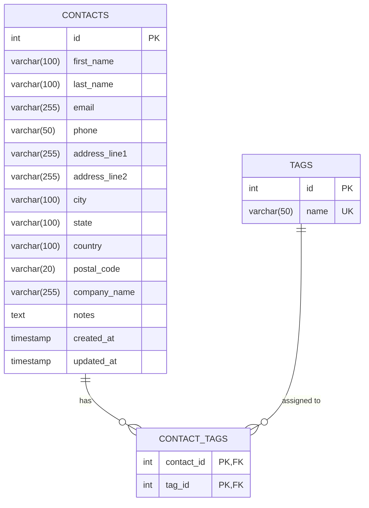

# Address Book Entity-Relationship Diagram

Below is the Mermaid ER diagram representing the relational database structure for the Address Book application.

## Relationships
- **Many-to-Many**: The `CONTACTS` table and `TAGS` table share a Many-to-Many relationship.
- **Junction Table**: This relationship is resolved by the `CONTACT_TAGS` junction table, which utilizes a composite primary key consisting of both `contact_id` and `tag_id`.
- **Integrity**: Both foreign keys in `CONTACT_TAGS` implement `ON DELETE CASCADE`. Removing a Contact or a Tag will automatically remove their associations from the junction table.
